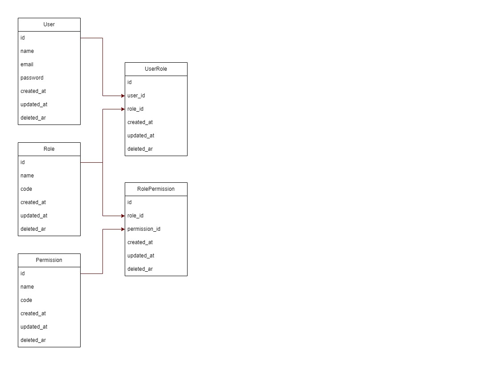

# Authentication Service
An authentication service is a component or system that handles user authentication and authorization within an application or system. It provides mechanisms for verifying the identity of users and granting them access to the appropriate resources based on their permissions.

